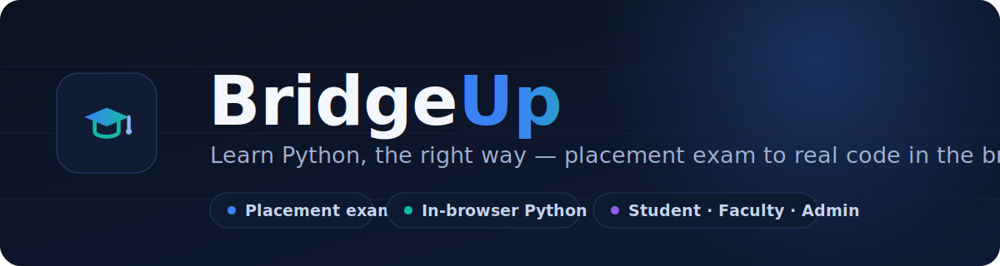

<p align="center">
  
</p>

<p align="center">
  <a href="#-quick-start"></a>
  
  
  
  
</p>

<p align="center">
  <b>🔗 <a href="https://gitswagata1.github.io/bridgeup/">Live demo — gitswagata1.github.io/bridgeup</a></b>
</p>

**BridgeUp** is a Python learning platform for first-year students. It starts with a short **placement exam**, sorts each learner into one of three levels, then walks them through an interactive course where **real Python runs in the browser** — no installs, no setup. It ships with three roles out of the box: **student**, **faculty**, and **admin**.

---

## ✨ Features

- **Placement exam → personalised track.** A 10-question diagnostic scores the learner and places them into **Beginner**, **Intermediate**, or **Advanced**, CS50-style, with a per-topic breakdown.
- **A real course.** *The Python Handbook* — **8 chapters, 99 sections** adapted from the [official Python Tutorial](https://docs.python.org/3/tutorial/). Every chapter has learning objectives, an auto-tracked checklist, a multiple-choice quiz, and a **graded coding challenge**.
- **Python that actually runs.** An in-page scratchpad executes real CPython via [Pyodide](https://pyodide.org) (WebAssembly). Standard input is supported and an infinite-loop guard keeps the tab responsive.
- **Downloadable study guides.** Each chapter exports a formatted **PDF** (overview, objectives, takeaways, practice, and full lesson content) via [jsPDF](https://github.com/parallax/jsPDF).
- **Three roles, one login.**
  - **Student** — takes the course and tracks their own progress.
  - **Faculty** — a read-only class dashboard: cohort analytics, per-chapter engagement, and a per-student drill-down.
  - **Admin** — a full console: every account, live progress, role management, database export, and resets.
- **Gamification.** XP for every lesson, quiz and challenge; five levels from Newcomer to Pythonista; daily learning streaks; and a downloadable **certificate of completion** with a verification code.
- **Progress that persists.** All state lives in the browser's `localStorage`, isolated per account.
- **Polished UX.** Cross-fade view transitions, keyboard-accessible focus states, a responsive dark theme, and tactile micro-interactions.

---

## 🔑 Demo accounts

The app seeds a demo cohort on first load, so every dashboard is populated immediately.

| Role        | Email                          | Password     |
| ----------- | ------------------------------ | ------------ |
| **Admin**   | `admin@bridgeup.app`           | `admin123`   |
| **Faculty** | `rao@vit.ac.in`                | `teach123`   |
| **Student** | `swagata@vitstudent.ac.in`     | `python123`  |

Additional demo students (all `python123`): `aisha@`, `ben@`, `cara@` `vitstudent.ac.in`.
The login screen shows the relevant demo credentials for whichever role you select.

---

## 🚀 Quick start

BridgeUp it must be **served over HTTP** (not opened as a `file://` URL) — the in-browser Python runtime and the Web Crypto password hashing both require a secure context, which `localhost` provides.

```bash
# clone
git clone https://github.com/gitswagata1/bridgeup.git
cd bridgeup

# serve (pick one)
python3 -m http.server 8750     # no dependencies
npm start                       # same command, via package.json
npx serve .                     # if you prefer Node
```

Then open **http://localhost:8750**.

> First time you run code, Pyodide downloads the Python runtime (~7 s). It's cached afterwards.

---

## 🗂 Project structure

```
bridgeup/
├── index.html          # App shell: nav, mount point, asset includes
├── css/
│   └── styles.css      # Design system, views, responsive rules, motion
├── js/
│   ├── auth.js         # Client-side accounts, roles, SHA-256 hashing (localStorage)
│   ├── data.js         # Placement exam, three levels, curriculum map, scoring
│   ├── handbook.js     # Course content: 8 chapters / 99 sections (official Python Tutorial)
│   ├── runner.js       # In-browser Python via Pyodide (stdin, loop guard, REPL echo)
│   ├── pdf.js          # Per-chapter PDF study guides via jsPDF
│   └── app.js          # Views, routing, progress, quizzes, challenges, dashboards, seed
├── docs/
│   └── banner.svg
├── package.json
├── LICENSE
└── README.md
```

---

## 🏗 How it works

**Routing.** A tiny hash-free router in `app.js` swaps the contents of `#app` for the active view (`home`, `exam`, `result`, `course`, `chapter`, `section`, `faculty`, `admin`, and the auth screen). Navigation between views uses the [View Transitions API](https://developer.mozilla.org/docs/Web/API/View_Transition_API) where available, and falls back to an instant repaint otherwise.

**The "database".** There is no backend. `localStorage` holds three things:

| Key                         | Purpose                                          |
| --------------------------- | ------------------------------------------------ |
| `bridgeup_accounts`         | All accounts (name, role, salted SHA-256 hash)   |
| `bridgeup_session`          | The currently signed-in email                    |
| `bridgeup:progress:<email>` | Per-account progress (score, sections, quizzes…) |

Passwords are hashed with the Web Crypto API before storage — never kept in plaintext. Registration is domain-gated: `@vitstudent.ac.in` for students, `@vit.ac.in` for faculty.

**In-browser Python.** `runner.js` lazy-loads Pyodide on first run, then reuses it. Each run executes in a fresh namespace, captures `stdout`/`stderr`, feeds any student-supplied input, echoes the last expression like a REPL, and aborts runaway loops with a step-count watchdog.

**Placement & progress.** The exam maps a score to a level in `data.js`; the course is defined in `handbook.js`. A chapter is "complete" when its sections are read, its quiz is passed (≥70%), and its coding challenge is solved — all tracked automatically and surfaced in the faculty and admin dashboards.

---

## 🌐 Deployment

Because there's no build step, deployment is just "host the files".

- **GitHub Pages** — push to `main`, then enable Pages (Settings → Pages → *Deploy from branch* → `main` / root).
- **Netlify / Vercel** — import the repo with **no build command** and the project root as the publish directory.

---

## 🔒 Security note

Authentication here is **demo-grade** and entirely client-side: accounts, sessions, and progress live in the visitor's browser. Passwords are hashed, but anyone with local access can inspect `localStorage`. This is ideal for a classroom demo or portfolio piece — for real deployments, move authentication and data to a proper backend.

---

## 🙌 Credits

- Course content adapted from the **[official Python Tutorial](https://docs.python.org/3/tutorial/)** (© Python Software Foundation, PSF License).
- **[Pyodide](https://pyodide.org)** — CPython compiled to WebAssembly.
- **[jsPDF](https://github.com/parallax/jsPDF)** — client-side PDF generation.
- Type: **Inter** and **Space Grotesk** via Google Fonts.

Built for first-year students at **VIT Vellore**.

---

## 📄 License

Released under the [MIT License](LICENSE).
